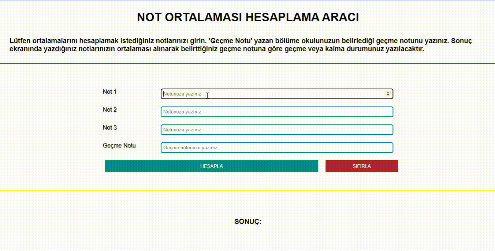

<h1>NOT HESAPLAMA ARACI</h1>

Yazılan sınav notlarını, geçme notuyla karşılaştırıp  
'Dersten geçtiniz.' veya 'Dersten kaldınız.'
şeklinde geri dönüt veren bir not hesaplama aracıdır.

<h2>EKRAN RESMİ</h2>

